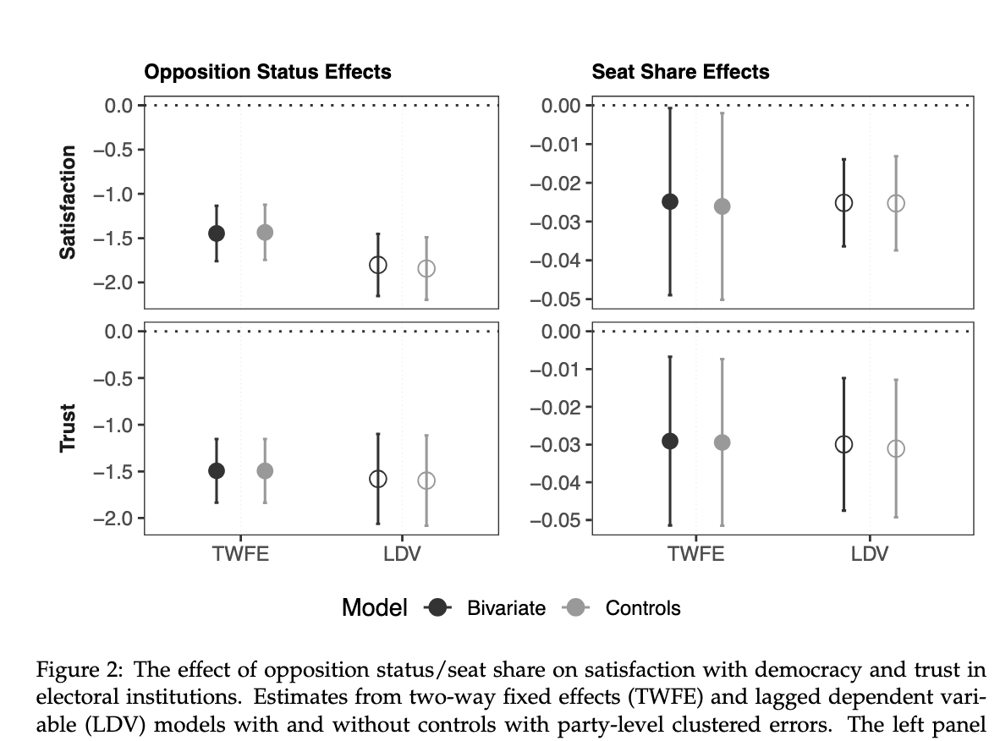

---

##### Download

+ [Paper](paper2.pdf)

---

##### Abstract

Does party performance in elections shape elected politicians' satisfaction with democracy? While prior work shows that losing candidates become less satisfied with democratic institutions, we know little about how \textit{winning} politicians respond when their party loses power. This article argues that elected officials grow more dissatisfied with democracy when their party loses influence over the executive or legislative branch. Using longitudinal data from 8,141 Latin American legislators, we show that both opposition status and seat losses reduce satisfaction with democracy and trust in elections. These effects persist even in consolidated democracies. Interviews with opposition legislators suggest that this dissatisfaction is often channeled through frustrations with internal party dynamics following electoral setbacks. The findings carry important implications for democratic stability: unlike losing candidates, dissatisfied elected losers retain formal decision-making power and, as visible electoral winners, may also amplify broader public discontent with democracy.

---

##### Figure 2: Dimensions of a sausage dog

---

##### Citation

Forthcoming

---

