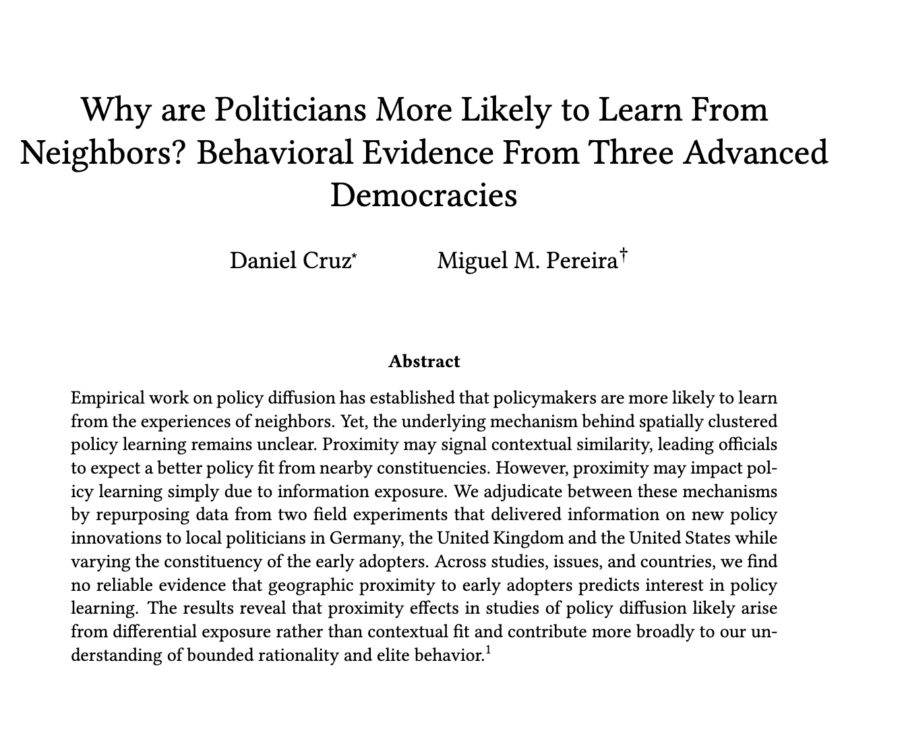

---

##### Download

+ [Paper](paper3.pdf)

---

##### Abstract

Empirical work on policy diffusion has established that policymakers are more likely to learn from the experiences of neighbors. Yet, the underlying mechanism behind spatially clustered policy learning remains unclear. Proximity may signal contextual similarity, leading officials to expect a better policy fit from nearby constituencies. However, proximity may impact policy learning simply due to information exposure. We adjudicate between these mechanisms by repurposing data from two field experiments that delivered information on new policy innovations to local politicians in Germany, the United Kingdom and the United States while varying the constituency of the early adopters. Across studies, issues, and countries, we find no reliable evidence that geographic proximity to early adopters predicts interest in policy learning. The results reveal that proximity effects in studies of policy diffusion likely arise from differential exposure rather than contextual fit and contribute more broadly to our understanding of bounded rationality and elite behavior.

---

##### Table 1: The effects of receiving an invitation from a co-national peer politician

---

##### Citation

Forthcoming

---

